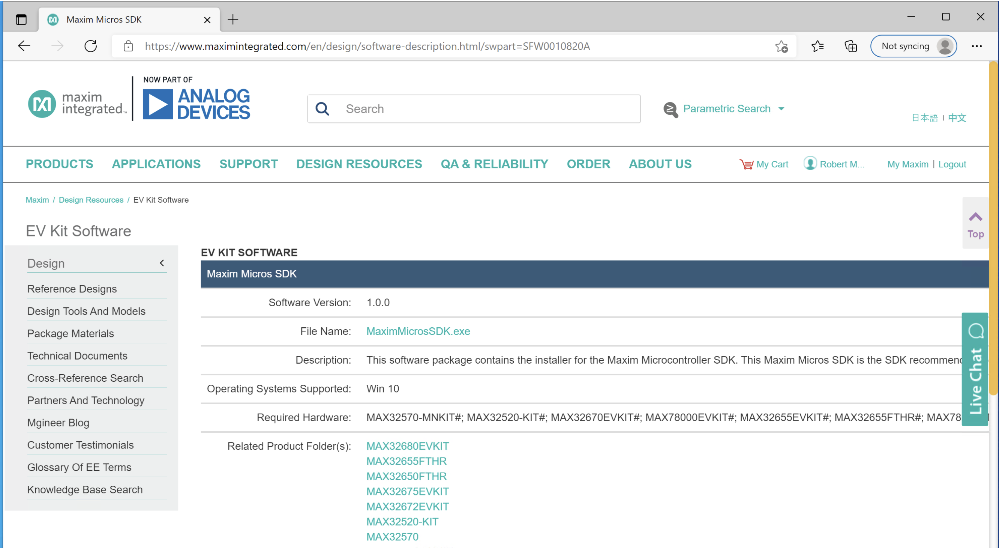
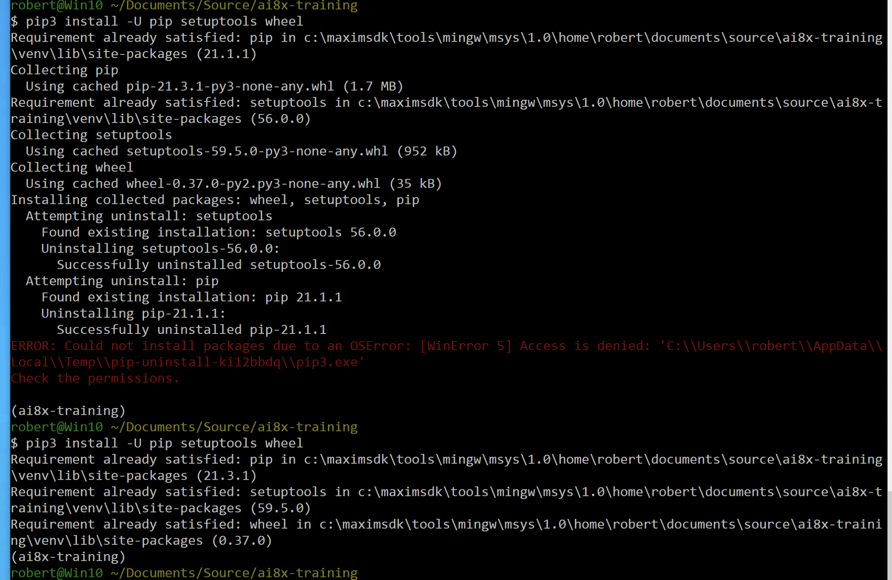

# Neural Network Training on Windows

*December 9, 2021*

The preferred and most compatible way to train networks is using the *[Windows Subsystem for Linux (WSL2)](https://github.com/MaximIntegratedAI/ai8x-synthesis/blob/develop/docs/WSL2.md).* However, WSL2 is not always available. The instructions in this document demonstrate how to train networks natively on Windows, without WSL2.

## Requirements

### 64-bit Windows

Windows **must** run in 64-bit mode. To check, use the Start menu and type “About”.


### Packages

Several applications and packages are needed. Some of the installation steps may require administrator privileges.

#### Maxim Micros SDK

Install the [Maxim Micros SDK](https://www.maximintegrated.com/en/design/software-description.html/swpart=SFW0010820A) for MAX7800X. 



#### Python

Install the latest available version of Python 3.8 from [python.org](https://python.org/downloads/windows/). As of late 2021, the latest available 3.8 version with a Windows installer was 3.8.10.


Run the installer, and add Python to the Path:


Allow the installer to disable the PATH length limit.


#### git

A git binary is required. Download git from [gitforwindows.org](https://gitforwindows.org/) or [git-scm.com](https://git-scm.com/download/win).


During setup, there are options can be selected for line endings and system settings. The following settings are recommended:


##### GIT_PYTHON_GIT_EXECUTABLE Environment Variable

Next, add a new environment variable that points to the location of git.exe. In the Start menu, type “environment” and open the Control panel. Under “System Properties” - “Advanced”, click “Environment Variables…” and add a “New User Variable” with the variable name `GIT_PYTHON_GIT_EXECUTABLE` and the “mapped” location of git.exe. This value is typically `/c/Program Files/Git/cmd/git.exe` as shown in the screen shot below.


## MAX78000 Training and Synthesis Repositories

The next step is to clone the ai8x-training and ai8x-synthesis repositories.

Open a MinGW shell using Start - Maxim Integrated SDK - MinGW:


Next, change to the target directory (the default is  `C:\MaximSDK\Tools\MinGW\msys\1.0\home\<name>\`).

Check out the training and synthesis repositories as detailed in the [main documentation](https://github.com/MaximIntegratedAI/ai8x-synthesis/blob/develop/README.md#upstream-code).


## Troubleshooting
### Could not Install Packages due to an OSError

When `pip3 install -U pip setup tools wheel` returns that it could not uninstall pip3.exe, simply ignore the error and repeat the command one more time.



### CUDNN_STATUS_INTERNAL_ERROR

On Windows, it may be necessary to limit the number of PyTorch workers to 1 to avoid crashes or internal errors such as `CUDNN_STATUS_INTERNAL_ERROR` in the training software.

Add `--workers=1` when running any training script, for example;

```shell
$ scripts/train_mnist.sh --workers=1
```

### Git Executable Error

When running `ai8xize.py` , the software may display an error regarding `GIT_PYTHON_GIT_EXECUTABLE` as shown below. Please set the `GIT_PYTHON_GIT_EXECUTABLE` environment variable as shown [above](#GIT_PYTHON_GIT_EXECUTABLE Environment Variable). 

As an alternative, run the following before calling `ai8xize.py`:

```shell
$ source scripts/set-git
```


*Error message:*


